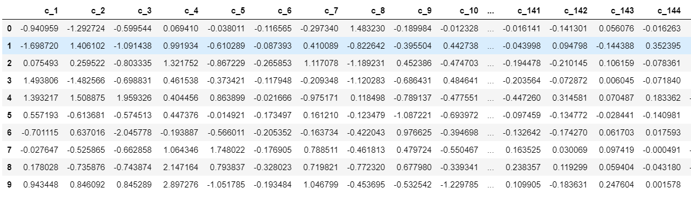

# Machine Learning Engineer Nanodegree
## Capstone Project
Pelle John
August 15th, 2020

## I. Definition

### Project Overview

The Capstone Project is the final submission for Udacitys Machine Learning Engineer Nanodegree Program. The selected project is based on a real-life example of Arvato, an internationally active services company with a focus on innovations in automation and data/analytics. The requested analysis in about the provided customer data set of a German mail-order sales company to identify customer cluster which can be used to predict the success of targeted marketing campaigns.

The clustering of customers and a respective personalization is a must-have in today's business world. A recent RedPoint Global survey<sup>1</sup> conducted by The Harris Poll that surveyed more than 3,000 consumers in the U.S., U.K., and Canada stated, that

> 63 percent, of consumers expect personalization as a standard of service and believe they are recognized as an individual when sent special offers

It clearly shows that companies need to take into account the characteristics of a customer when choosing the channel, message, and method in a marketing campaign. Multiple studies show, that personalization has a huge impact on the success of a marketing campaign. A study in 2013 by Experian Marketing Services<sup>2</sup> shows that
 
 > personalized promotional emails were shown to lift transaction rates and revenue per email six times higher than non-personalized emails.
 
The relevance in today's business world, as well as the variety of different machine learning methods to be used in this exercise, excites me the most. it gives the possibility to try different methods and explore different libraries and methods while having a clear goal in mind.

The request is split into three main objectives. First, get an overall understanding of the provided customer and German population database to derive an understanding of the data and clean/transform it in a way that it can be used for the following machine learning exercises. 

Secondly, the cleaned data should be used to derive the population cluster which is mapped to the customer database to identify and analyze the relationships between the demographics of the company's existing customers and the general population of Germany. The goal of the second part of the analysis is to describe the parts of the general population that are more likely to be part of the mail-order company's main customer base, and which parts of the general population are less so.

Lastly, the provided understanding should be the basis to train a classification/prediction model based on an existing mailout campaign. In the end, we should be able to use the demographic information from each individual to decide whether or not it will be worth it to include that person in the campaign to and predict the likelihood of response for future mailout campaigns.

The analysis is based on four main datasets, which are all provided by Arvato. The first is a dataset of 891.211 persons (rows) and 366 features (columns) on demographics data for the general population of Germany. It will be used to define a general descriptive cluster for a later mapping of the mail-order company customer base. The customer database consists of  191 652 persons (rows) and 369 features (columns) with demographics data for customers of a mail-order company. It will be used to identify which cluster is in the current customer base of the mail-order company. For classification/prediction model are a train (42 982 persons (rows) with 367 (columns)) and a test dataset (42 982 persons (rows) x 366 (columns)) provided. The train has an additional "RESPONSE" column and will be used to train the classification model for the prediction of success of future targeted marketing campaigns. The test model is without the "RESPONSE" column and can be used in a KAGGLE competition for the success of future targeted marketing campaigns.

### Problem Statement

The problem statement can be split into the main two tasks of the analysis: **Population/Customer Segmentation** and **Classification/Prediction**

#### Population/Customer Segmentation

The key problem to solve is to prepare and cluster the population data in a way, that we can define a clear cluster of interest for the mail-order company, once the customer base is mapped to the trained classificator. Therefore, the key objective is first to transform the dataset, to remove the noise, and to define the major differentiator. 

The data transformation will be done in multiple steps. First, we get an overview of the available German population and customer base dataset (columns, data types, shape, unique, distribution, and percentage of the missing values per column). Once, we have a good understanding of the provided dataset, we start to identify missing values and replace them accordingly. Columns/rows, with a high percentage of missing data, will be removed from the dataset, as they don't provide clear differentiators for the later segmentation. Next, we encode the categorical values to be able to further work with them in the segmentation and transformation process.

After a data normalization step, the simplified German population dataset will be used for a PCA (principal component analysis), as it is a fast and flexible unsupervised method for dimensionality reduction in data. It involves zeroing out one or more of the smallest principal components, resulting in a lower-dimensional projection of the data that preserves the maximal data variance<sup>3</sup>.

Once we reduced the noise and dimensions of the segmentation, we will train and optimize a **KMeans cluster algorithm** to detect customer segmentations.
 
The trained cluster model will be used on the customer dataset (which is transformed in the same way as the general population database) to compare the percentages of people per cluster in both datasets. The trained cluster model will show the population cluster, which has a higher/lower percentage as the general Population representation and, therefore, more probably more likely to respond to future marketing/sales campaigns.

#### Classification/Prediction

The key question of the second part of the analysis is: What are effective data transformation/classification approaches to have a stable and accurate prediction on the response rate of individuals on targeted marketing campaigns based on available potential customer demographic data. **The key challenge will be, that we will develop a classification/prediction engine with a very imbalanced dataset (most of the participants did not respond)**. Therefore, some steps in the data preparation will be done slightly differently to compensate for it.

Similar to the first start of the exercise, the analysis will start with the task to understand the provided datasets. After that, we will do similar data cleansing and transformation steps. The data cleansing and transformation will start to replace the missing data, to remove columns with high missing values percentages, to transform categorical values, to remove rows with high missing values percentages, drop non-important columns, replace NaN values and normalize the dataset for a PCA analysis.

The transformed dataset will be split in train and test dataset and then different classification algorithms (SVM, RandomForest,...) and over- and undersampling techniques will be used to train a sufficient classification/prediction model. The trained and evaluated models will be used on the TEST dataset for the KAGGLE competition.

### Metrics

To determine the effectiveness of the used method/model, both parts of the analysis have seperate evalution metrices:

**Population/Customer Segmentation**: J. Kleinberg<sup>5</sup> defined three properties any clustering algorithm should try to satisfy: The axioms of scale invariance, richness, and consistency. He also proved an an impossibility theorem that shows that no clustering algorithm can simultaneously satisfy all of them. In our exercise we willl focus on finding the right number k (number of cluster) via the Elbow method and validated via Silhouette Coefficient, which is used as ground truth labels are not known and the evaluation must be performed using the model itself.

**Classification/Prediction**: For the classification and prediction we will use the accuracy, precision, recall and AUC scores<sup>7</sup>:

* **Accuracy**: Computes the accuracy, either the fraction (default) or the count (normalize=False) of correct predictions
     ```
* **Precision**: Precision is the ability of the classifier not to label as positive a sample that is negative
    ```tp / (tp + fp)```
* **Recall**:  Recall is the ability of the classifier to find all the positive samples
    ```tp / (tp + fn)``` 
* **AUC (Area Under the ROC Curve):** To better evaluate the correctness for the prediction of an inbalanced dataset, the incorporate the AUC mteric, which provides an aggregate measure of performance across all possible classification thresholds. One way of interpreting AUC is as the probability that the model ranks a random positive example more highly than a random negative example<sup>8, 9</sup>:  j}^c (\text{AUC}(j | k) +\text{AUC}(k | j))">

  TP = True Positives; FP = False Positives; FN = False Negatives

## II. Analysis

### Data Exploration

All four datasets for the analysis of  the German mail-order sales company customer have the basis of 366 different columns, which can be split into the following sections:

1. **Personal information (43 columns)**: Information about the respective person in the dataset. This includes, e.g., information on age, gender, and typologies on financial characteristics, life stage, family, social status, and socioeconomic traits.

2. **Household information (32 columns)**: Information about the household the person lives in. This includes, e.g., the number of people, the household structure, transactional activities, and the duration of residence.

3. **Building & postcode and community information (19 columns)**: Information on the building the person lives in. This includes, e.g., the number of households, the type of building, car segments in the neighborhood, the distance from the city center or next metropole, inhabitants, and the share of unemployed persons in the community.

4. **Microcell RR1_ID, RR4_ID & RR3_ID (67 columns)**: Information about a cluster the respective person falls in. This includes the CAMEO typology segmentation and other information like, e.g., the share of car owners in the respective cell, the number of trailers, the number of 1-2 family houses, purchasing power, moving patterns, and online affinity.

5. **AZ Cluster data - 125m x 125m Grid (33 columns)**: Information on transactional data from the mail-order activities for a specific product group for a specific grid. Is based on data from AZ, which has access to 650 Million transaction data.

6. **Postal code related statistics - PLZ8 (114)**: Based on federal German statistics on the postal code. Contains column-like, e.g., the share of car owners per type like BMW, the car engine power, and most-common car types.

**Only for customer dataset**: The customer set has three additional columns "PRODUCT_GROUP, CUSTOMER_GROUP, ONLINE_PURCHASE" which gives information about the respective product group and online_purchase information.

**Only for mailout train dataset**: The dataset has one additional column "REPONSE" to support the training of a supervised classificator.

The datasets for Segmentation/Clustering exercise have the following characteristics:

```
Description about data types in population database:
<class 'pandas.core.frame.DataFrame'>
RangeIndex: 891221 entries, 0 to 891220
Columns: 366 entries, LNR to ALTERSKATEGORIE_GROB
dtypes: float64(267), int64(93), object(6)
memory usage: 2.4+ GB
None

Description about data types in customer database:
<class 'pandas.core.frame.DataFrame'>
RangeIndex: 191652 entries, 0 to 191651
Columns: 369 entries, LNR to ALTERSKATEGORIE_GROB
dtypes: float64(267), int64(94), object(8)
memory usage: 539.5+ MB
None
```

Both datasets have categorical columns and a large set of data. One of the key challenges will be to reduce the number of input data so we can process it efficiently. None of the columns has more than one data type and columns are sorted in alphabetical order. A check for uniqueness of the values revealed, that only one column has more than 500 different data entries and is unique:

````
First impression of data LNR:
0    910215
1    910220
2    910225
3    910226
4    910241
Name: LNR, dtype: int64
Column data types: int64
Sum empty values (absolute/percentage): 0 / 0.0
Rows values unique identifier (Length dataset vs. unique values): True
````
LNR is the index, which we can later use for the KAGGLE competition. A check-in the documentation revealed, that LNR acts as an ID number for each individual in the data partition. The second highest value distribution was in the column ["EINGEFUEGT_AM"]. As this is a piece of plain information on the last update/insert, we also exclude it for further analysis.

**Note:** Some column information are described in more than one column in the dataset (e.g., no. of kids). Also additional columsn exist for the creation of the row, the last update and a unique identifier. Therefore, the number of columns per category do not exactly add up to 366 columns.

### Exploratory Visualization

The number of features is insufficient for a clustering and segmentation algorithm. To better assess the potential, a correlation matrix for the dataset on the German  population was composed to identify potentials for improvement.


The axes list the features in the German population dataset. The color-encoding represents the correlation between the respective features. Dark blue represents a high correlation close to 1. White represents a low correlation close to 0. A reduced color-density was used to highlight the areas with a very high correlation. 

The correlation matrix shows, that there are multiple feature sets with high correlation. The most important observations are highlighted in red. Especially for the Postal Code related statistics around cars and for the Microcell features. A PCA should be performed to reduce the noise and highlight, extract the most important features in the dataset. 

Secondly, to further identify possible improvement potentials, an analysis was performed to identify the columns with more than 25% missing values. The result was the following:

```
['ALTER_KIND4', 'ALTER_KIND3', 'ALTER_KIND2', 'ALTER_KIND1', 'AGER_TYP', 'EXTSEL992', 'KK_KUNDENTYP', 'ALTER_HH', 'ALTERSKATEGORIE_FEIN', 'D19_LETZTER_KAUF_BRANCHE', 'D19_SOZIALES', 'D19_VERSAND_ONLINE_QUOTE_12', 'D19_LOTTO', 'D19_KONSUMTYP', 'D19_TELKO_ONLINE_QUOTE_12', 'D19_BANKEN_ONLINE_QUOTE_12', 'D19_VERSI_ONLINE_QUOTE_12', 'D19_GESAMT_ONLINE_QUOTE_12']

Number of columns with more than 25% missing values = 18
```

These features are partly redundant based on other features. Therefore, it will be a good step to exclude them from further data cleansing and transformation process. Similar exercises were done for the MAILOUT train dataset for the prediction/clustering algorithm, which resulted in similar results.

### Algorithms and Techniques

The following algorithms/techniques were used for the Segmentation/Clustering and for the Classification/Prediction analysis:

1. [LabelEncoder()](https://scikit-learn.org/stable/modules/generated/sklearn.preprocessing.LabelEncoder.html#sklearn.preprocessing.LabelEncoder): Used to transform non-numerical labels (as long as they are hashable and comparable) to numerical labels.
2. [MinMaxScaler()](https://scikit-learn.org/stable/modules/generated/sklearn.preprocessing.MinMaxScaler.html?highlight=minmaxscaler#sklearn.preprocessing.MinMaxScaler): This estimator scales and translates each feature individually such that it is in the given range on the training set, e.g. between zero and one. The transformation is given by:
```python
X_std = (X - X.min(axis=0)) / (X.max(axis=0) - X.min(axis=0))
X_scaled = X_std * (max - min) + min
```
3. df.fillna(df.mean()): Fill NA/NaN values using the medium of the specific column. Similar to: [SimpleImputer(strategy='mean')](https://scikit-learn.org/stable/modules/generated/sklearn.impute.SimpleImputer.html#sklearn.impute.SimpleImputer).
4. [NaN_replace_KNNImputer](https://scikit-learn.org/stable/modules/generated/sklearn.impute.KNNImputer.html#sklearn.impute.KNNImputer)]: The KNNImputer class provides imputation for filling in missing values using the k-Nearest Neighbors approach. 
5. [PCA()](https://scikit-learn.org/stable/modules/generated/sklearn.decomposition.PCA.html?highlight=pca#sklearn.decomposition.PCA): Principal component analysis (PCA) is a technique for reducing the dimensionality of large datasets, increasing interpretability but at the same time minimizing information loss. It does so by creating new uncorrelated variables that successively maximize variance.<sup>3</sup>

**Population/Customer Segmentation**

6. [KMeans()](https://scikit-learn.org/stable/modules/generated/sklearn.cluster.KMeans.html?highlight=kmeans#sklearn.cluster.KMeans): The KMeans algorithm clusters data by trying to separate samples in n groups of equal variance, minimizing a criterion known as the inertia or within-cluster sum-of-squares This algorithm requires the number of clusters to be specified. It scales well to a large number of samples and has been used across a large range of application areas in many different fields<sup>4</sup>.

The K-means algorithm aims to choose centroids that minimise the inertia, or within-cluster sum-of-squares criterion:


**Classification/Prediction**

7. [SMOTETomek()](https://imbalanced-learn.readthedocs.io/en/stable/generated/imblearn.combine.SMOTETomek.html#imblearn.combine.SMOTETomek): Class to perform over-sampling using SMOTE and cleaning using Tomek links. TomekLinks detects the so-called Tomek’s links [T2010](https://imbalanced-learn.readthedocs.io/en/stable/under_sampling.html#t2010). A Tomek’s link between two samples of different class x and y is defined such that for any sample z:

```
d(x, y) < d(x, z) \text{ and } d(x, y) < d(y, z)
```
   where d(.) is the distance between the two samples. In some other words, a Tomek’s link exists if the two samples are the nearest neighbors of each other. In the figure below,   a Tomek’s link is illustrated by highlighting the samples of interest in green. The parameter **sampling_strategy** control which sample of the link will be removed.             <sup>10</sup>

For the classification/prediction, the analysis tries a variety of different methods from different classification categories:

8. **Linear Algorithms** - [LogisticRegression()](https://scikit-learn.org/stable/modules/generated/sklearn.linear_model.LogisticRegression.html): Logistic regression, despite its name, is a linear model for classification rather than regression. Logistic regression is also known in the literature as logit regression, maximum-entropy classification (MaxEnt), or the log-linear classifier. In this model, the probabilities describing the possible outcomes of a single trial are modeled using a logistic function.
9. **Ensemble Algorithms**:
    1. [AdaBoost Classifier()](https://scikit-learn.org/stable/modules/generated/sklearn.ensemble.AdaBoostClassifier.html?highlight=adaboost#sklearn.ensemble.AdaBoostClassifier):     The core principle of AdaBoost is to fit a sequence of weak learners (i.e., models that are only slightly better than random guessings, such as small decision trees) on repeatedly modified versions of the data. The predictions from all of them are then combined through a weighted majority vote (or sum) to produce the final prediction.  
    2. [BalancedRandomForestClassifier()](https://scikit-learn.org/stable/modules/generated/sklearn.ensemble.RandomForestClassifier.html?highlight=randomforest#sklearn.ensemble.RandomForestClassifier): A random forest is a meta estimator that fits several decision tree classifiers on various sub-samples of the dataset and uses averaging to improve the predictive accuracy and control over-fitting. 
    3. [GradientBoostingClassifier()](https://scikit-learn.org/stable/modules/generated/sklearn.ensemble.GradientBoostingClassifier.html?highlight=gradientboostingclassifier#sklearn.ensemble.GradientBoostingClassifier): Gradient Tree Boosting or Gradient Boosted Decision Trees (GBDT) is a generalization of boosting to arbitrary differentiable loss functions. GBDT is an accurate and effective off-the-shelf procedure that can be used for both regression and classification problems in a variety of areas including Web search ranking and ecology.
    4. [RUSBoostClassifier():](https://imbalanced-learn.readthedocs.io/en/stable/generated/imblearn.ensemble.RUSBoostClassifier.html): RUSBoostClassifier randomly under-sample the dataset before to perform a boosting iteration [SKHN2010](https://sci2s.ugr.es/keel/pdf/algorithm/articulo/2010-IEEE%20TSMCpartA-RUSBoost%20A%20Hybrid%20Approach%20to%20Alleviating%20Class%20Imbalance.pdf).
    5. [EasyEnsembleClassifier()](https://imbalanced-learn.readthedocs.io/en/stable/generated/imblearn.ensemble.EasyEnsembleClassifier.html#imblearn.ensemble.EasyEnsembleClassifier): A specific method which uses AdaBoost as learners in the bagging classifier is called EasyEnsemble. The EasyEnsembleClassifier allows a bag of AdaBoost learners who are trained on balanced bootstrap samples [LWZ2009](https://citeseerx.ist.psu.edu/viewdoc/download?doi=10.1.1.309.1465&rep=rep1&type=pdf).
10. [StratifiedKFold](https://scikit-learn.org/stable/modules/generated/sklearn.model_selection.StratifiedKFold.html): KFold divides all the samples into k groups of samples, called folds (if k-1, this is equivalent to the Leave One Out strategy), of equal sizes (if possible). The prediction function is learned using k - 1 folds, and the fold left out is used for the test. StratifiedKFold is a variation of k-fold which returns stratified folds: each set contains approximately the same percentage of samples of each target class as the complete set.
11. [GridSearchCV()](https://scikit-learn.org/stable/modules/generated/sklearn.model_selection.GridSearchCV.html): Hyper-parameters are parameters that are not directly learnt within estimators. In scikit-learn, they are passed as arguments to the constructor of the estimator classes. Typical examples include C, kernel, and gamma for Support Vector Classifier, alpha for Lasso, etc. It is possible and recommended to search the hyper-parameter space for the best cross-validation score. Any parameter provided when constructing an estimator may be optimized in this manner.

### Benchmark

A benchmark is best suited for the classification exercise to predict the success of a targeting marketing campaign. Similar exercises on Kaggle (see below) assume a prediction rate of 75% to 80% ROC score. That is what we will aim for in this exercise. Nevertheless, the analysis will show if we can achieve that with the imbalance of the dataset. The respective Kaggle competition in the exercise suggests between 75% and 80% RUC score.

Similar Kaggle Notebooks/ Competitions:
* https://www.kaggle.com/c/springleaf-marketing-response
* https://www.kaggle.com/c/udacity-arvato-identify-customers/leaderboard

## III. Methodology

## Population/Customer Segmentation

### Data Preprocessing

The following steps have been conducted to preprocess the data for the **Population/Customer Segmentation** exercise for both datasets.

1. The first we need to do with the datasets is to **replace and handle missing values**. Therefore, we need to identify values that represent NaN and replace it. Moreover, we want to focus on dates that are filled more than 70% to be used in the dataset. Before we start the replacement we want to check if the datatypes in the respective column are the same. The following values were identified as wrongly placed NaN values:

```
zero_unkown_list = ['ALTER_HH', 'AGER_TYP', 'CJT_GESAMTTYP', 'HEALTH_TYP']
XX_unkown_list = ['CAMEO_DEU_2015', 'CAMEO_DEUINTL_2015']
overall_replace_values = [-1] #function replaces all values >= 0
```
2. Now that all values have been properly replaced with np. NaN values, we want to exclude the columns which have more than 25% NaN values. We save the values in a string to make sure that we, later on, drop the columns for the customer dataset as well:

```
['EINGEFUEGT_AM', 'LNR', 'ALTER_KIND4', 'ALTER_KIND3', 'ALTER_KIND2', 'ALTER_KIND1', 'AGER_TYP', 'EXTSEL992', 'KK_KUNDENTYP', 'ALTER_HH', 'ALTERSKATEGORIE_FEIN', 'D19_LETZTER_KAUF_BRANCHE', 'D19_SOZIALES', 'D19_VERSAND_ONLINE_QUOTE_12', 'D19_LOTTO', 'D19_KONSUMTYP', 'D19_TELKO_ONLINE_QUOTE_12', 'D19_BANKEN_ONLINE_QUOTE_12', 'D19_VERSI_ONLINE_QUOTE_12', 'D19_GESAMT_ONLINE_QUOTE_12']
```

Note: We added the unique identifier ['LNR'] and the update field ['EINGEFUEGT_AM'], as they have more than 50 categories and produce a lot of unnecessary noise in the overall clustering model.

3. Next, we want to identify the values which are not **float** or **int**, and therefore will need some additional encoding. Looping through the types of columns result in the following dates:

```
['CAMEO_DEU_2015', 'CAMEO_DEUG_2015', 'CAMEO_INTL_2015', 'OST_WEST_KZ']
```

4. The categorical columns will be encoded with the Algorithm described LabelEncoder(). Note: A future improvement of the segmentation could be to encode them with OneHotEncoder, to reduce the possibility of connections between the data in a column by the clustering model. The problem is since there are different numbers in the same column, the model will misunderstand the data to be in some kind of order, 0 < 1 < 2. But this isn’t the case at all. To overcome this problem, we use One Hot Encoder.<sup>11</sup>

5. The still-missing values will be filled via the KNNImputer and then normalized for the Principal Component Analysis. Before we start the analysis, a final check was conducted across the General Population dataset:

```
azdias_td_3.head(10)
azdias_td_3.describe()
```


The datasets seem correct and can, therefore, be further processed via PCA. 

Note: A further optimization potential is to further process columns with a very one-sided skewed data distribution or data with more than 40 categories to further reduce noise in the dataset for the clustering model.

6. Next, a PCA() Principal component analysis was conducted. The following diagram shows the portion of variance explained by the number of components. The analysis suggets t gather around 85% to 95% of the variance. For the further segmentation analysis, 150 variables a composed explaining >90% of the variance of the dataset. The result of the PCA() is, that we could reduce the number of dimensions from 346 to 150 (which also simplifies the training) and were able to reduce the overall noice in the dataset.


```python
# test cell
n_top_components = 110 # select a value for the number of top components

# calculate the explained variance
exp_variance = hps.explained_variance(s, n_top_components)
print('Explained variance: ', exp_variance)

Explained variance:  0.8507474950159595
```

Moreover, to get a first insight in the dataset, we display the makeup of the first component, explaining the highest portion of variance:


The composition of the PCA results in the final dataset, ready for the **Population/Customer Segmentation**:

```
azdias_td_cp_3.head(10)
```


### Implementation

The implementation was smooth and no major changes/specifications have been made. The dataset was split up multiple times to be able to process them in the respective workbook without running out of memory. All helper functions to process the data were documented in an additional file.

### Refinement

The advancements have been laid out throughout the data processing process. Summarized, the following three improvement potential could be picked up by future students:
1. Remove the rows with significant NaN values
2. Separate processing strategies for numerical and binary categories
3. Use an OneHoteEncoder for categorical categories
4. Transform columns with one-sided data distributions

## IV. Results

### Model Evaluation and Validation

Research suggests, that K-Means is the standard clustering and segmentation algorithm for big datasets<sup>12,13</sup>. Therefore, it was decided to use this algorithm for the exercise. To determine the number of clusters, the elbow method was used which runs k-means clustering on the dataset for a range of values for k (from 1-20) and then for each value of k computes an average score of inertia. Inertia gives the sum of squared distances of samples to their closest cluster center. To determine the optimal number of clusters, we have to select the value of k at the “elbow” ie the point after which the inertia starts decreasing linearly. Thus for the given data, we conclude that the optimal number of clusters for the data is **8**.

```python
#Find the right K Cluster
wcss = []

for i in range(1, 20):
    kmeans = KMeans(n_clusters=i, init='k-means++', max_iter=300, n_init=10, random_state=0)
    kmeans.fit(azdias_td_cp_3)
    wcss.append(kmeans.inertia_)
    
plt.plot(range(1, 20), wcss)
plt.title('Elbow Method')
plt.xlabel('Number of clusters')
plt.ylabel('WCSS')
plt.show()
```


The number of eight clusters is used to fit the model on the German population dataset:

```python
# The right value of K is - 8 is the number to go
kmeans = KMeans(n_clusters=8, init='k-means++', max_iter=300, n_init=10, random_state=0)
pred_y = kmeans.fit_predict(azdias_td_cp_3)
ax = cluster_df.plot.bar(rot=0, color='blue')
```


The eight clusters have a fairly even distribution besides the cluster seven with a population size from 80.000 to 140.000. To better understand the composition of a cluster, the component/dimensions wit the highest variance across the eight clusters are displayed:


The plot shows the eight clusters on the x-axis and the variance of the respective components on the y-axis. For example, A high correlation with component 5 was the main factor for the distribution to cluster 7. The main 15 dimensions in the dataset were are the ones who explain the most variance among them. Components 5, 1, 2, and 7 play a significant role. They will be used to better explain the customer cluster, once they are mapped.

Next, the customer dataset is transformed along with the data processing steps of the German population dataset and the KMeans model was used to determine the cluster for each person in the dataset. The following plot displays the absolute and percentage distribution for both datasets:


The percentage plot shows that cluster 3 and 4 are significantly overrepresented, while cluster 0 and 1 are underrepresented.

A positive correlation for the components 1 and 2 are the major factor for cluster 3 and 4. The next figure shows the dimensions with the highest correlations with components 1 and 2. The positive correlations lead to the interpretation that the mail-order companies' clients are normally well-off families with multiple persons in their household, a medium to high income. The customer is of the older generation and are normally more traditional/save money.


The mirror in some aspects the opposite of cluster 0 and 1. Looking closer at the additional component 7 for cluster 2, the mail-order company is less represented in areas with significantly more households, which would mean also less income / single house-owner. Moreover, the number of high inhabitants leads to the conclusion that these are more often people from urban areas, with a lower age.


### Justification

The first analysis of the segments indicate differences in the customer base of the mail-order company. A further enhancement of the clusters could be used to personalize their marketing activities. Further enhancements, which are listed in the improvement section, are possible.

## Classification/Prediction

### Data Preprocessing

The following steps have been conducted to preprocess the data for the **Classification/Prediction** exercise for both datasets:

1.) 

## V. Conclusion (Population/Customer Segmentation & Classification/Prediction)
_(approx. 1-2 pages)_

### Free-Form Visualization
In this section, you will need to provide some form of visualization that emphasizes an important quality about the project. It is much more free-form, but should reasonably support a significant result or characteristic about the problem that you want to discuss. Questions to ask yourself when writing this section:
- _Have you visualized a relevant or important quality about the problem, dataset, input data, or results?_
- _Is the visualization thoroughly analyzed and discussed?_
- _If a plot is provided, are the axes, title, and datum clearly defined?_

### Reflection
In this section, you will summarize the entire end-to-end problem solution and discuss one or two particular aspects of the project you found interesting or difficult. You are expected to reflect on the project as a whole to show that you have a firm understanding of the entire process employed in your work. Questions to ask yourself when writing this section:
- _Have you thoroughly summarized the entire process you used for this project?_
- _Were there any interesting aspects of the project?_
- _Were there any difficult aspects of the project?_
- _Does the final model and solution fit your expectations for the problem, and should it be used in a general setting to solve these types of problems?_

### Improvement
In this section, you will need to provide discussion as to how one aspect of the implementation you designed could be improved. As an example, consider ways your implementation can be made more general, and what would need to be modified. You do not need to make this improvement, but the potential solutions resulting from these changes are considered and compared/contrasted to your current solution. Questions to ask yourself when writing this section:
- _Are there further improvements that could be made on the algorithms or techniques you used in this project?_
- _Were there algorithms or techniques you researched that you did not know how to implement, but would consider using if you knew how?_
- _If you used your final solution as the new benchmark, do you think an even better solution exists?_

-----------

**Before submitting, ask yourself. . .**

- Does the project report you’ve written follow a well-organized structure similar to that of the project template?
- Is each section (particularly **Analysis** and **Methodology**) written in a clear, concise and specific fashion? Are there any ambiguous terms or phrases that need clarification?
- Would the intended audience of your project be able to understand your analysis, methods, and results?
- Have you properly proof-read your project report to assure there are minimal grammatical and spelling mistakes?
- Are all the resources used for this project correctly cited and referenced?
- Is the code that implements your solution easily readable and properly commented?
- Does the code execute without error and produce results similar to those reported?

-----------

## Sources:
<sup>1</sup> https://www.redpointglobal.com/blog/addressing-the-gaps-in-customer-experience-redpoint-global-harris-poll-benchmark-survey/</br>
<sup>2</sup> https://www.experian.com/assets/marketing-services/white-papers/ccm-email-study-2013.pdf</br>
<sup>3</sup> https://jakevdp.github.io/PythonDataScienceHandbook/05.09-principal-component-analysis.html</br>
<sup>4</sup> https://scikit-learn.org/stable/modules/clustering.html#k-means</br>
<sup>5</sup> https://dl.acm.org/doi/10.5555/2968618.2968676
<sup>6</sup> https://scikit-learn.org/stable/modules/clustering.html#clustering-performance-evaluation
<sup>7</sup> https://scikit-learn.org/stable/modules/model_evaluation.html#accuracy-score
<sup>8</sup> https://developers.google.com/machine-learning/crash-course/classification/roc-and-auc
<sup>9</sup> https://scikit-learn.org/stable/modules/model_evaluation.html#roc-metrics
<sup>10</sup> https://imbalanced-learn.readthedocs.io/en/stable/under_sampling.html#tomek-links
<sup>11</sup> https://medium.com/@contactsunny/label-encoder-vs-one-hot-encoder-in-machine-learning-3fc273365621
<sup>12</sup> https://hdbscan.readthedocs.io/en/latest/comparing_clustering_algorithms.html
<sup>13</sup> https://towardsdatascience.com/the-5-clustering-algorithms-data-scientists-need-to-know-a36d136ef68

